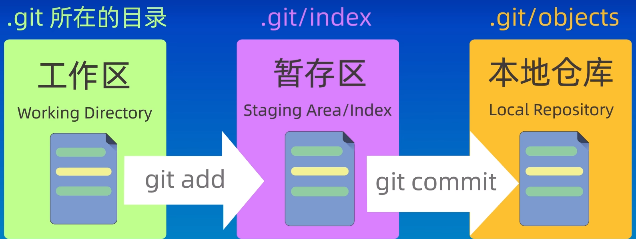
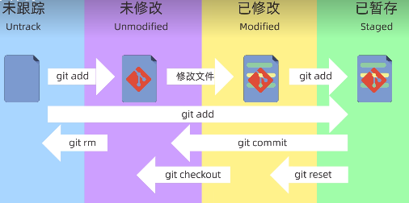
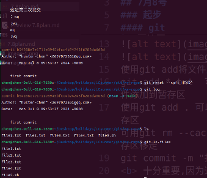
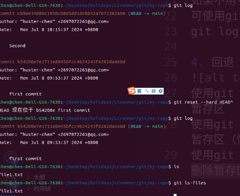
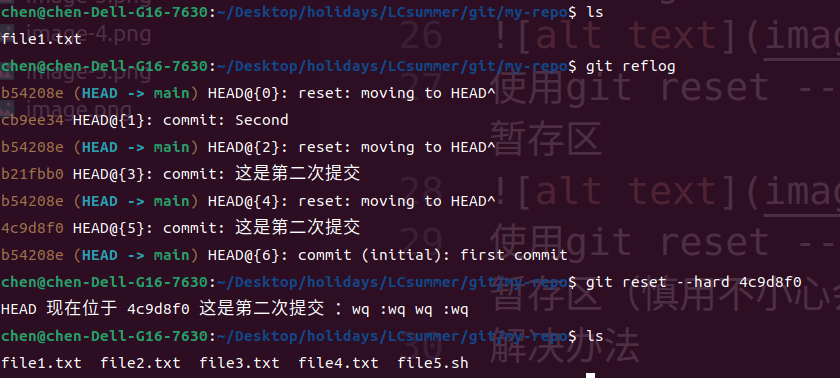
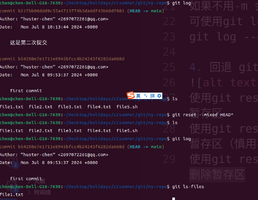
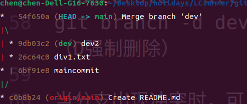

# 联创夏令营学习
[toc]
## 7月8号

### 起步

#### git
##### 仓库：https://github.com/huster-chen/Webinsummer.git
##### git命令详细学习
git init + name 创建仓库
git status 查看当前仓库状态
##### 工作区

使用git add将文件从工作区添加到暂存区
git add *.txt  可将所有以TXT结尾的文件添加到暂存区
使用git add . 可以将所有文件添加到暂存区
可用git rm --cached <文件>将文件从暂存区移走
git commit -m "提交信息" 
##### 十分重要,因为这个在返回版本中依靠这个信息来看返回哪个版本，最好详细表明具体情况</b>
如果不用-m 会自动进入vim界面 编辑信息
可使用git log 查看提交记录
git log --oneline 查看简洁提交记录
 
##### 回退 git reset
使用git reset --soft 会保留工作区和暂存区

使用git reset --hard 会清空工作区和暂存区（慎用不小心会删除当前文件）
解决办法
可以使用git reflog查看操作历史记录 然后找到误操作之前的版本号，回退到之前就可以

使用git reset --mixed 可以保留工作区删除暂存区

##### git diff
比较工作区和暂存区的差异 git diff
比较工作区和版本库的差异 git diff HEAD
比较暂存区和版本库之间的差异 git diff cached
比较两个版本之间的差异 后面加上两次版本的提交id
(HEAD 指向分支的最新提交节点 HEAD~n指向head前第n个结点)
git diff HEAD~ HEAD
git diff HEAD^ HEAD
git diff HEAD~2 HEAD
##### git rm
同时删除工作区和暂存区
记得提交，否则在版本库还是存在
从版本库中删除 git rm --cached
##### .gitignore 
创建.gitignore 将名字放在这个文件中
##### git branch
git branch +name 创建新的分支
git checkout name 切换到新的分支
checkout 还可以恢复文件
后改用git switch name
切换到main 分支 用git merge +name 将分支合并到main上
可通过git log --graph --oneline --decorate --all 来查看分支图

git branch -d dev 删除已合并的分支（D强制删除）

当分支出现冲突时，可以 git diff查看冲突，然后修改冲突文件

若不想继续合并可以用git merge --abort
##### git rebase
形成线性提交记录 会改变提交历史
避免在公共上使用rebase
